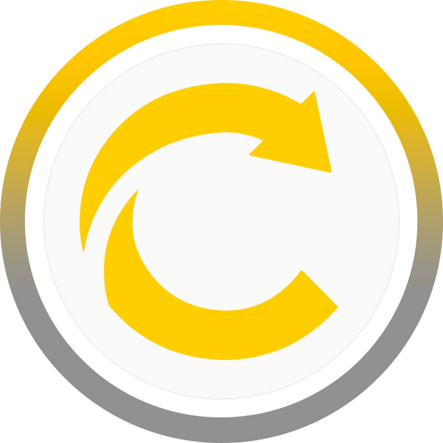

<div id="top"></div>

<!-- PROJECT LOGO -->
<br />
<div align="center">
  <a href="https://github.com/RafaelDalarosa/Codeeducation2">
    
  </a>

  <h3 align="center">Full Cycle Docker Project</h3>

  <p align="center">
    A Project to test purposes of Docker!
    <br />
    <a href="https://github.com/RafaelDalarosa/Codeeducation2"><strong>Explore the docs »</strong></a>
    <br />
    <br />
    <a href="https://github.com/RafaelDalarosa/Codeeducation2/issues">Report Bug</a>
    ·
    <a href="https://github.com/RafaelDalarosa/Codeeducation2/issues">Request Feature</a>
  </p>
</div>


<!-- TABLE OF CONTENTS -->
<details>
  <summary>Table of Contents</summary>
  <ol>
    <li>
      <a href="#about-the-project">About The Project</a>
      <ul>
        <li><a href="#built-with">Built With</a></li>
      </ul>
    </li>
    <li>
      <a href="#getting-started">Getting Started</a>
      <ul>
        <li><a href="#prerequisites">Prerequisites</a></li>
        <li><a href="#installation">Installation</a></li>
      </ul>
    </li>
    <li><a href="#contact">Contact</a></li>
  </ol>
</details>


<!-- ABOUT THE PROJECT -->
## About The Project

This project have a goal to containerization a aplicattion in Nodejs API with Nginx Proxy Server.

<p align="right">(<a href="#top">back to top</a>)</p>


### Built With

Technologies and Languages used in this project!

* [Nginx](https://www.nginx.com/)
* [Node](https://nodejs.org/en/)
* [Docker](https://www.docker.com/)


<p align="right">(<a href="#top">back to top</a>)</p>


<!-- GETTING STARTED -->
## Getting Started

### Prerequisites

- First need install Docker in your device.

Access Docker Website and choose you OS https://www.docker.com/get-started

### Installation

1. Clone the repo
   ```sh
   git clone https://github.com/RafaelDalarosa/Codeeducation2
   ```
2. Execute the containers in Docker
   ```sh
   docker-compose up
   ```

<p align="right">(<a href="#top">back to top</a>)</p>

<!-- CONTACT -->
## Contact

Rafael Dalarosa - contato@rafaeldalarosa.com.br

Project Link: [https://github.com/RafaelDalarosa/Codeeducation2](https://github.com/RafaelDalarosa/Codeeducation2)

<p align="right">(<a href="#top">back to top</a>)</p>

